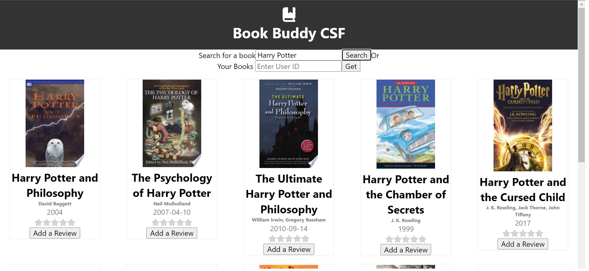

# Books App Frontend
A web application that stores book reviews from users.

The front-end is created using create-react-app, it uses various libraries including Font-Awesome for images and assets, Jest for a boiler-plate test suite, Prettier for formatting, and jscss to optimize css files.

## Setup
First install all the required packages (libraries mentioned in the comments above or in package.json). Instructions to run the application, when you have all dependencies installed are provided below. Also, attached are some screenshots for the app. To achieve the intended experience, please ensure the Backend Express API and database is running. Documentation for that will be found in BookReviewAPI Folder.

## Features 
-The application allows users to find any book they are interested in reading anytime, anywhere.
-It allows users the ability to comment and rate their experiences with their books and share it with others(Review title, Review text, Star Rating and userName selection).
-The application collects all reviews and creates an aggregate star rating to provide some idea of the popular opinions
-It also allows users to only see the books that they had reviewed in the past, and update their feedback as their experiences change

## Future Improvements 
While I aimed to build quite a comprehensive project with the abiltiy to quickly look up textbooks and provide quick feedback to its readers. There are some aspects of the application that can be improved upon : 
-It can be made more secure by allowing users to create private keys to make their interactions completely private.
-There can be many more fields added to the book reviews to allow more comprehensive interactions. Some of the features that I had setup in the back-end but I didnt have time to establish in the front-end are : A Slider to track how much of the book the user has finished or how many times, Providing the ability to users to comment on or make changees to a books description provided by the publisher.
-The UI made with a focus on utility, but it can be very basic or unappealing for some.

## Available Scripts

In the project directory, you can run:

### `npm start`

Runs the app in the development mode.\
Open [http://localhost:3000](http://localhost:3000) to view it in your browser.

The page will reload when you make changes.\
You may also see any lint errors in the console.

### `npm test`

Launches the test runner in the interactive watch mode.\
See the section about [running tests](https://facebook.github.io/create-react-app/docs/running-tests) for more information.

### `npm run build`

Builds the app for production to the `build` folder.\
It correctly bundles React in production mode and optimizes the build for the best performance.

The build is minified and the filenames include the hashes.\
Your app is ready to be deployed!

See the section about [deployment](https://facebook.github.io/create-react-app/docs/deployment) for more information.

### `npm run eject`

**Note: this is a one-way operation. Once you `eject`, you can't go back!**

If you aren't satisfied with the build tool and configuration choices, you can `eject` at any time. This command will remove the single build dependency from your project.

Instead, it will copy all the configuration files and the transitive dependencies (webpack, Babel, ESLint, etc) right into your project so you have full control over them. All of the commands except `eject` will still work, but they will point to the copied scripts so you can tweak them. At this point you're on your own.

You don't have to ever use `eject`. The curated feature set is suitable for small and middle deployments, and you shouldn't feel obligated to use this feature. However we understand that this tool wouldn't be useful if you couldn't customize it when you are ready for it.

## Learn More

You can learn more in the [Create React App documentation](https://facebook.github.io/create-react-app/docs/getting-started).

To learn React, check out the [React documentation](https://reactjs.org/).

### Code Splitting

This section has moved here: [https://facebook.github.io/create-react-app/docs/code-splitting](https://facebook.github.io/create-react-app/docs/code-splitting)

### Analyzing the Bundle Size

This section has moved here: [https://facebook.github.io/create-react-app/docs/analyzing-the-bundle-size](https://facebook.github.io/create-react-app/docs/analyzing-the-bundle-size)

### Making a Progressive Web App

This section has moved here: [https://facebook.github.io/create-react-app/docs/making-a-progressive-web-app](https://facebook.github.io/create-react-app/docs/making-a-progressive-web-app)

### Advanced Configuration

This section has moved here: [https://facebook.github.io/create-react-app/docs/advanced-configuration](https://facebook.github.io/create-react-app/docs/advanced-configuration)

### Deployment

This section has moved here: [https://facebook.github.io/create-react-app/docs/deployment](https://facebook.github.io/create-react-app/docs/deployment)

### `npm run build` fails to minify

This section has moved here: [https://facebook.github.io/create-react-app/docs/troubleshooting#npm-run-build-fails-to-minify](https://facebook.github.io/create-react-app/docs/troubleshooting#npm-run-build-fails-to-minify)
